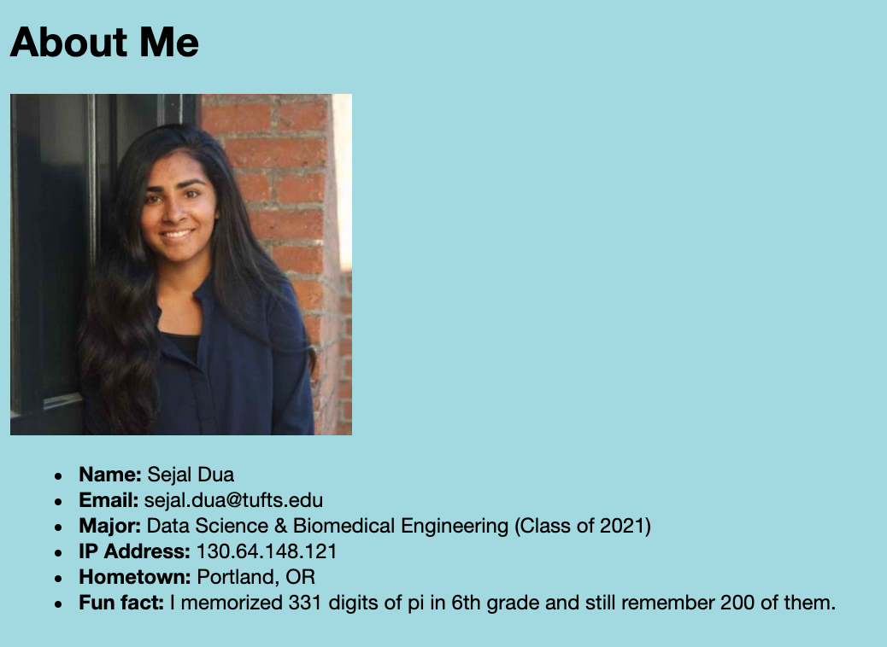
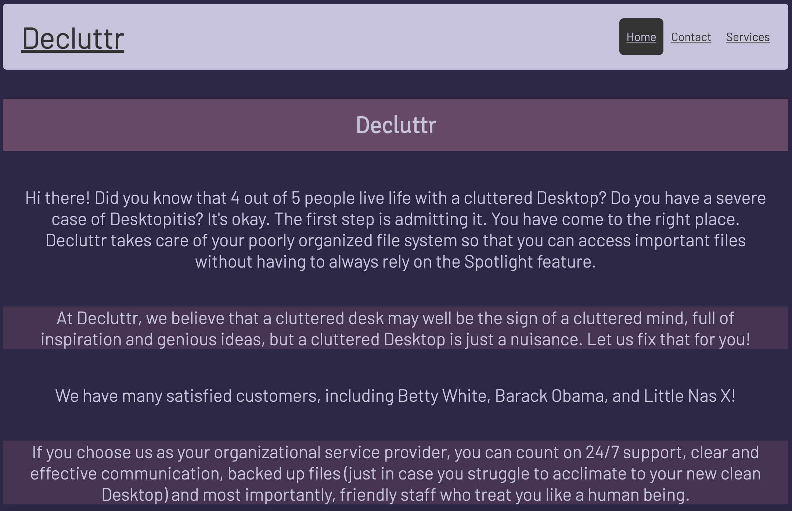
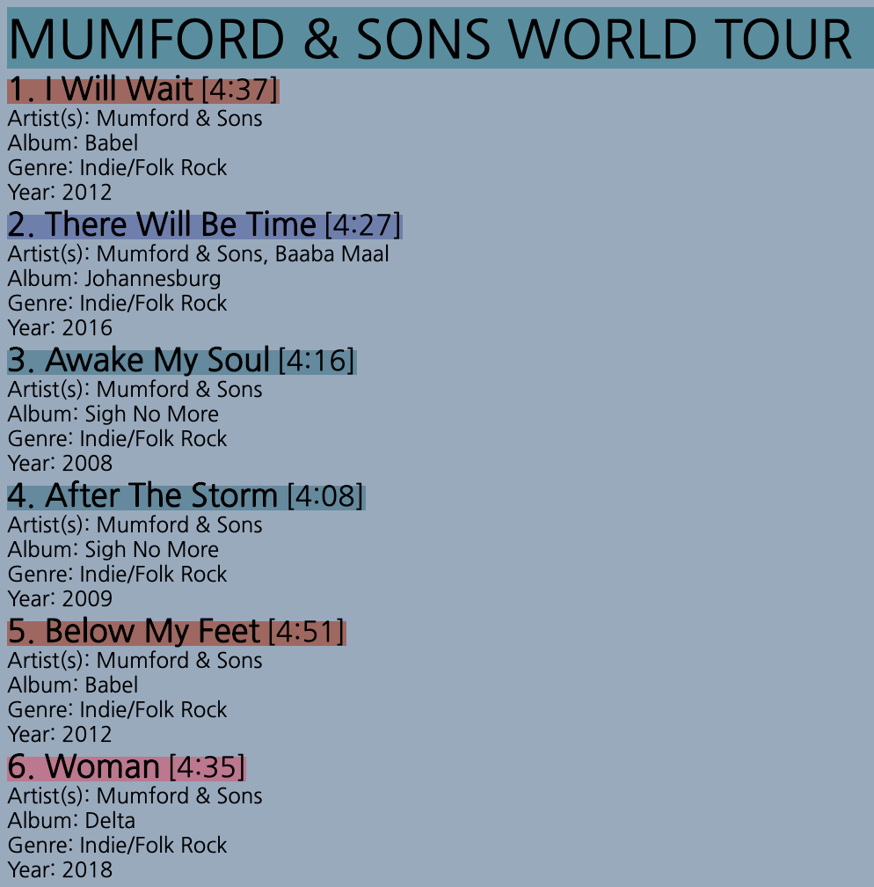

# web-programming
Homework and projects from COMP20: Web Programming (taken in Spring 2020)

### Assignment 2: Introduction
**URL:** https://sejaldua.com/web-programming/hw2/introduction.html  
**Language(s):** HTML, CSS  
**Description:** Create a simple webpage to introduce yourself.  

### Assignment 3: Simple Website
**URL:** https://sejaldua.com/web-programming/hw3/index.html  
**Language(s):** HTML, CSS  
**Description:** Create a simple website for a service business or a cause (or charitable organization).  

### Assignment 4: Concert Setlist
**URL:** https://sejaldua.com/web-programming/hw4/concert.xml  
**Language(s):** XML, CSS  
**Description:**  Create an XML document to represent a set list for a cover band.  Each entry should have space to describe the artist(s), title, music genre, and year the song was released. Must include at least 10 songs. The data must be real, but you can use any artist/band. Create a CSS file for aesthetic display of the data.  
