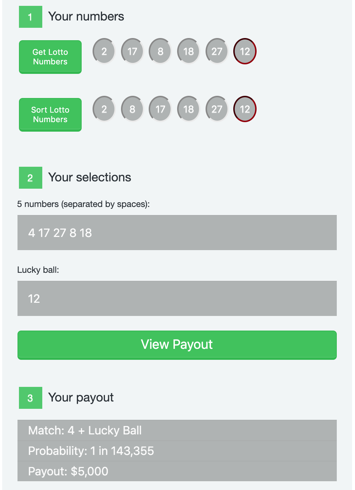

# web-programming
Homework and projects from COMP20: Web Programming (taken in Spring 2020)

### Assignment 2: Introduction
**URL:** https://sejaldua.com/web-programming/hw2/introduction.html  
**Language(s):** HTML, CSS  
**Description:** Create a simple webpage to introduce yourself.  

### Assignment 3: Simple Website
**URL:** https://sejaldua.com/web-programming/hw3/index.html  
**Language(s):** HTML, CSS  
**Description:** Create a simple website for a service business or a cause (or charitable organization).  

### Assignment 4: Concert Setlist
**URL:** https://sejaldua.com/web-programming/hw4/concert.xml  
**Language(s):** XML, CSS  
**Description:**  Create an XML document to represent a set list for a cover band.  Each entry should have space to describe the artist(s), title, music genre, and year the song was released. Must include at least 10 songs. The data must be real, but you can use any artist/band. Create a CSS file for aesthetic display of the data.  

### Assignment 5: Joe's Hotdog Stand
**URL:** https://sejaldua.com/web-programming/hw5/index.html  
**Language(s):** HTML, CSS, Javascript  
**Description:** Create a web page to get an order for a new café called “Joe’s Hotdog Stand”.
Joe’s only sells three items: hotdogs ($3.25 each), French Fries ($2.00 each) and Drinks ($1.50 each).  Because of the low prices, Joe is swamped and is hoping online orders will help to manage the flow of customers better so that he can gain more revenue at peak hours. This assignment includes a form, some Javascript conditional checks to apply a discount and/or tax to the order, and then a receipt is displayed as an event handler for a button press.  

### Assignment 6: Javascript Arrays
#### Part 1: Quick Pick Lottery
**URL:** https://sejaldua.com/web-programming/hw6/lucky_ball.html  
**Language(s):** HTML, CSS, Javascript  
**Description:**  Implement a "quick pick" for a Mass Lottery "Lucky for Life" game. Randomly generate 5 numbers from 1 to 49 plus one lucky ball from 1 to 18. Sort the numbers (excluding the lucky ball) and display them. Allow the user to enter 5 numbers and a lucky ball selection. When a button is pressed, parse the data and compare the user-entered numbers with the randomly generated numbers. Then determine the winning payout of the user's pick.  

#### Part 2: Amicable Numbers
**URL:** https://sejaldua.com/web-programming/hw6/amicable_nums.html  
**Language(s):** HTML, CSS, Javascript  
**Description:** A factor is a number that divides evenly into another number.  A pair of numbers are called amicable if their factors (excluding themselves) add up to each other. For example, the numbers 220 and 284 are amicable, because the factors of 220 are [1, 2, 4, 5, 10, 11, 20, 22, 44, 55, 110] and sum to 284,while the factors of 284 are [1, 2, 4, 71, 142] and sum to 220. Implement an amicable number checker using Javascript arrays and variables.  

### Assignment 7: Jade Delight
**URL:** https://sejaldua.com/web-programming/hw7/jade_delight.html  
**Language(s):** HTML, CSS, Javascript  
**Description:**  Add validation (using Javascript) to the provided HTML form. The validation should be approached in two parts: when the user selects a quantity and when the user clicks submit.  

### Assignment 9: JSON
**URL:** https://sejaldua.com/web-programming/hw9/index.html  
**Language(s):** HTML, CSS, Javascript, JSON  
**Description:** Your assignment is to create a JSON to represent a set list for a cover band.  Each entry should have space to describe the artist(s), title, music genre(s), and year the song was released. Includes a form that allows the user to filter by a genre, only showing songs within the setlist that match the selected genre.  

### Assignment 10: API Fun
**URL:** https://sejaldua.com/web-programming/api-fun/index.html  
**Language(s):** HTML, CSS, Javascript, JSON, APIs  
**Description:** Use the AJAX data pattern we learned to send a request to the API, retrieve some data and display the data.  

